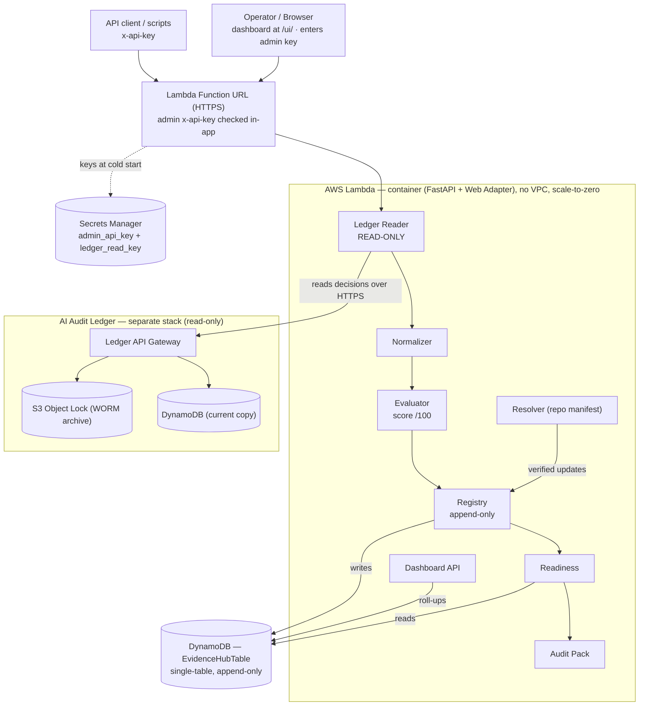

# Evidence Hub — what we built today, in plain English

## The one-line problem

Your **AI Audit Ledger** already records, immutably, *what an AI decision was and
that it hasn't been tampered with*. It does **not** tell you whether that decision
has all the **evidence** an auditor would ask for — the model approval, the data
lineage, the policy check, the human-review rationale — what's **missing**, who
**owns** each gap, and what's been **fixed**. The **Evidence Hub** is the layer
that answers that, without ever touching the ledger.

Today we took the Evidence Hub from "runs on my laptop" to "running in AWS."

## The picture

*(An editable draw.io version is in `evidence-hub-architecture.drawio` — regenerate
with `python tools/generate-architecture-diagram.py`.)*

## What we did today, in order

1. **Made the storage swappable, and added a DynamoDB backend.**
   The app used to save everything to a local SQLite file. We put a thin
   "storage interface" in front of it so the *same* app can write to either
   SQLite (for local work) or **DynamoDB** (in AWS) — chosen by one setting.
   No table is ever overwritten; every change is a new row, which is exactly the
   append-only behaviour the spec demands.

2. **Wrapped the app so it runs as an AWS Lambda.**
   The Evidence Hub is a normal Python web app (FastAPI). We packaged it as a
   **container image** with the AWS *Lambda Web Adapter*, which lets that
   unchanged web app run inside Lambda. This is also why you needed Docker — the
   image gets built and pushed to AWS.

3. **Added a lock on the front door.**
   Every data route now requires an **admin key** sent as an `x-api-key` header.
   The key (and the ledger read key) live in **AWS Secrets Manager**, not in
   code. Locally, with no key configured, the lock is simply off.

4. **Wrote the infrastructure as code (CDK).**
   One small stack creates the DynamoDB table, the secret, the Lambda, a public
   **Function URL**, and the permissions — and prints out the URL and the secret's
   address. `cdk deploy` builds everything in one command.

5. **Made the hosted dashboard usable.**
   Because the front door is now locked, the browser dashboard asks you for the
   admin key once, remembers it, and attaches it to every request.

## Why each choice (the trade-offs)

- **DynamoDB, not a SQL database.** Your ledger is 100% serverless DynamoDB with
  **no VPC and no database server to babysit**. We matched that: cheapest at low
  volume, nothing running when idle, no networking to manage.
- **Lambda + Web Adapter, not a rewrite.** It lets the existing FastAPI app run
  as-is and **scale to zero** (you pay essentially nothing when no one's using
  it), instead of paying for an always-on server.
- **Single internal deployment.** You run *one* Evidence Hub over *your* ledger,
  with a simple admin key. Per-customer multi-tenancy can come later; this got us
  live fastest.
- **The Hub only ever *reads* the ledger, over its public HTTPS API.** It never
  touches the ledger's AWS resources. That keeps the immutable ledger the single
  source of truth and the two systems cleanly separated.

## The journey of one request (what actually happens)

1. You call the Function URL with your admin key (browser or `curl`).
2. The Lambda wakes up, checks the key against Secrets Manager.
3. The **Ledger Reader** fetches that decision from your ledger over HTTPS —
   read-only — including its tamper-evidence status.
4. The **Normalizer** unpacks it (including fields buried in the decision JSON)
   and flags bad data, like a reviewer name stuffed into the model field.
5. The **Evaluator** scores it against nine evidence categories (0–100) and lists
   exactly what's missing and who should fix it.
6. The result is written to **DynamoDB** (append-only), and the **Readiness**
   view + **Audit Pack** can be read back any time.

## What's live and proven

Deployed to `eu-west-1`, account `174405733864`, and verified end-to-end:

- `/health` → `store=dynamodb`, `ledger=live`.
- An authed evaluation of a real ledger decision returned **41/100 "partial",
  integrity "verified"** — proving the full chain: Function URL → Lambda → reads
  your ledger over HTTPS → writes evidence to DynamoDB → reads it back.
- Locally: **34 automated tests pass**, including the *same* behaviour checked
  against both SQLite and DynamoDB.

## What's next (optional, nothing blocking)

- **Auto-resolve in production** — point the deployed Hub at an evidence manifest
  so it auto-fills the static gaps (model/data/policy/prompt), lifting scores the
  way it does locally (41 → 68).
- **Connectors** — MLflow / OPA / Great Expectations, etc., that *verify* evidence
  against the real systems instead of asserting it from a file.
- **Multi-tenant** — if you ever sell this as a hosted product rather than running
  one internal instance.
